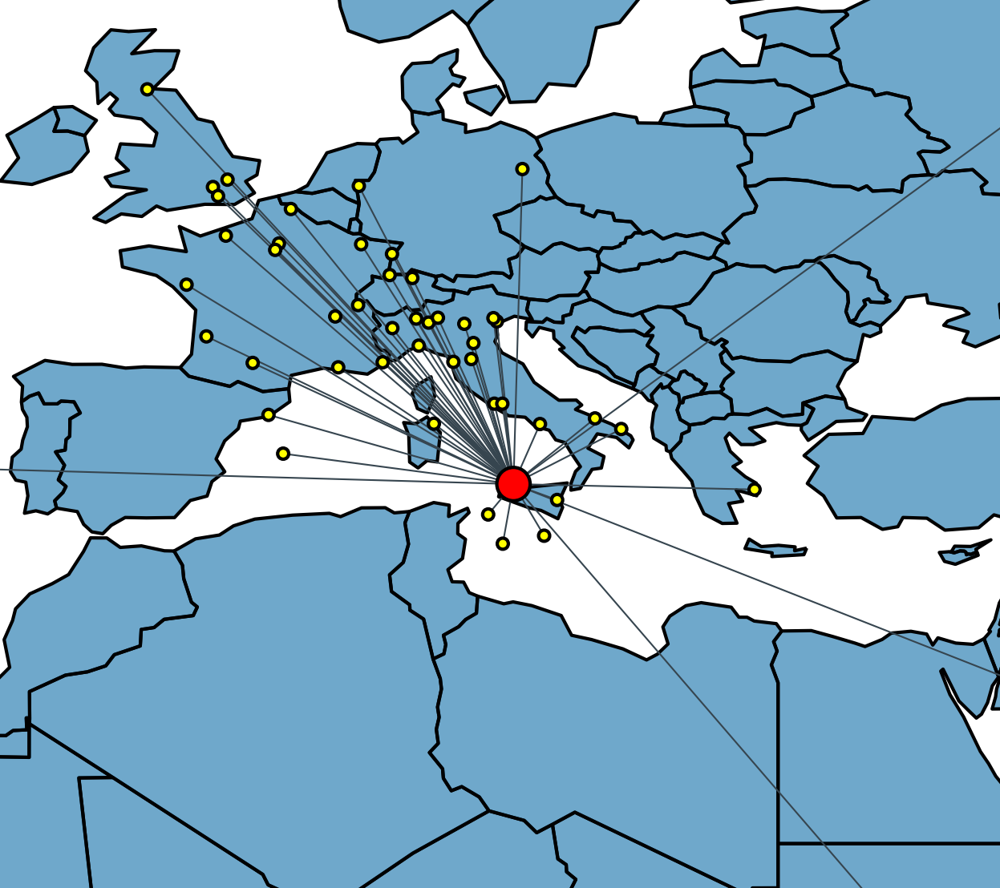

  
  <h1 align="center">Complex Networks Palermo</h1>

This repository is the official database for the [Complex Networks (21958)](https://www.unipa.it/persone/docenti/m/salvatore.micciche/?pagina=insegnamento&idInsegnamento=155641&idCattedra=149802) course by [Salvatore Miccichè](https://www.unipa.it/persone/docenti/m/salvatore.micciche/) in [Università degli Studi di Palermo](https://www.unipa.it/).

You can see all the base code [here in the source folder](source/) or using NBViewer by following this link: \
[**Main Notebook Folder**](https://nbviewer.org/github/CNPalermo/complex-networks-palermo/tree/main/source)

Exercises and various snippets of codes are uploaded in the contributions section, check it out [here in the GitHub folder](source/) or in NBViewer: \
[**Contribution Folder**](https://nbviewer.org/github/CNPalermo/complex-networks-palermo/tree/main/contributions)

## Getting Started

Tutorial for python and jupyter in general are coming...

### Dependencies

If you only want to run the notebooks you just need these packages (versions are the only one tested):
- numpy **≥ 1.24**
- python-igraph **≥ 0.10**
- matplotlib **≥ 3.6**
- pycairo **≥ 1.23** _(for igraph plot)_
- geopandas **≥ 0.12** _(for grographic plots)_

## Acknowledgments

This repository was made by [Alessandro Romancino](https://github.com/alex180500) with contribution by:
- Mattia Romeo

Also many good resources were used for this repository:
- M. Newman, [**Networks**](https://doi.org/10.1093/oso/9780198805090.001.0001) _Oxford University Press (2018)_
- V. Latora, V. Nicosia and G. Russo, [**Complex Networks**: Principles, Methods and Applications](https://doi.org/10.1017/9781316216002) _Cambridge University Press (2017)_

## Contributing

Please, if you make an exercise or some cool Complex Network code, you are **encouraged** to add it here. Also, feel free to open discussions on the Issue page and issuing your pull requests!

Please make sure your code is well documented following a format similar to the notebooks present in this repository. In order to add your files just follow these steps:

- Fork the project on your profile
- Create your branch `git checkout -b feature`
- Commit your changes with your files in the contributions folder `git commit -m 'added these features here'` (**please provide good comments!**)
- Push to your branch `git push origin feature`
- Open a pull request here

## Roadmap

- [x] Add tutorials for data import and the CN logo
- [ ] igraph cheatsheet
- [ ] Add various model constructores
- [ ] Add conda guide and how to install python
- [ ] Jupyter guide
- [ ] Git guide

